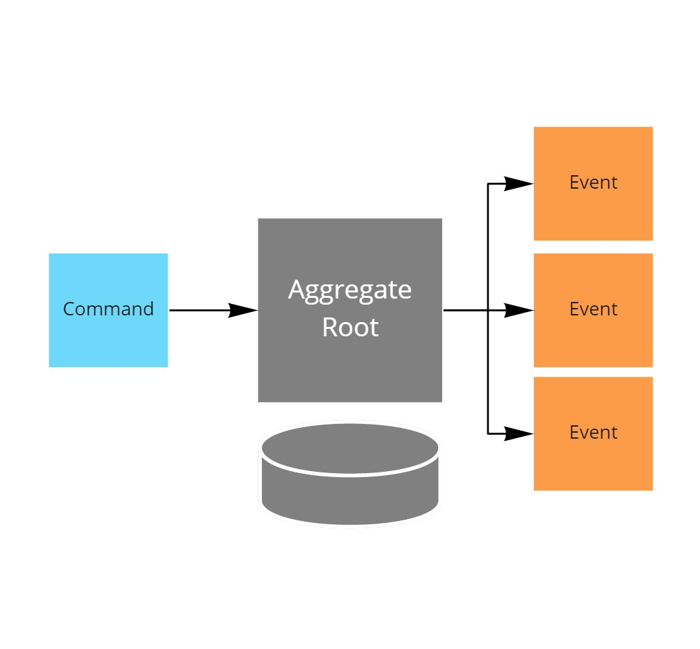

# Designing an Aggregate Root

This project is part of the [MessageHandler processing patterns](https://www.messagehandler.net/patterns/) library.

MessageHandler is distributed under a commercial license, for more information on the terms and conditions refer to [our license page](https://www.messagehandler.net/license/).

## What you need to get started

- The [.NET 6 SDK](https://dotnet.microsoft.com/en-us/download) should be installed
- The sample was created using [Visual Studio 2022 community edition](https://visualstudio.microsoft.com/vs/)
- A general purpose [azure storage account](https://docs.microsoft.com/en-us/azure/storage/common/storage-account-create?tabs=azure-portal) is used to store events.
- To use the outbox an [azure service bus namespace](https://docs.microsoft.com/en-us/azure/service-bus-messaging/service-bus-create-namespace-portal) or [eventhub](https://docs.microsoft.com/en-us/azure/event-hubs/event-hubs-create) is required.
- The **MessageHandler.EventSourcing.AzureTableStorage** package is available from [nuget.org](https://www.nuget.org/packages/MessageHandler.EventSourcing.AzureTableStorage/)
- The optional **MessageHandler.EventSourcing.Outbox** package is also available from [nuget.org](https://www.nuget.org/packages/MessageHandler.EventSourcing.Outbox/)

## What is an Aggregate Root

An aggregate is a cluster of domain objects that is treated as a single unit. Any references from outside the aggregate should only go to the aggregate root. 
The root can thus ensure the integrity of the aggregate as a whole.

As an aggregate root is responsible for maintaining integrity of the whole, it is the primary responsible for deciding if a command can be executed on the aggregate or not.

This decission will be recorded as an event on an event stream and any internal state is updated in response to the recorded event.



## Usage of the Aggregate Root pattern

Basic usage of the aggregate root pattern involves the following steps:
- Build up the history as a list of events
- Restore the aggregate from that history
- Invoke commands on the aggregate root, which will result in pending events
- Commit the pending events, which will make them part of the history

```C#
var bookingId = Guid.NewGuid().ToString();
var history = new List<SourcedEvent>();

var booking = new OrderBooking(bookingId);
booking.RestoreFrom(history);

booking.Book(purchaseOrder);
booking.Confirm();

var pendingEvents = booking.Commit();
```

This usage type serves as the basis for unit testing the aggregate root pattern and test driven development.

As MessageHandler is intented to be unit test friendly, you can find example unit tests built this way in the [samples solution](/src/)

## Implementing the Aggregate Root

Implementing an Aggregate Root requires two steps.

Add a command method that first validates if integrity would be violated, then emit the relevant decission as an event.

Secondly store the internal state of the aggregate based on events emitted, by implementing respective `IApply` interfaces.

These Apply methods will be called both upon restoration of the aggregate and after emitting a new event.

```C#
public class OrderBooking : EventSourced,
                            IApply<PurchaseOrderBooked>
{
    public OrderBooking(string id) : base(id)
    {
    }

    // command
    public BookingValidationResult Book(string bookingReference,PurchaseOrder purchaseOrder, string userId = null){

        // maintain integrity
        if (this._bookingReference != null) {
            return new BookingValidationResult() { Success = false };
        }

        // record decision
        Emit(new PurchaseOrderBooked()
        {
            TenantId = purchaseOrder.SellerReference,
            Context = new Context
            {
                Id = Id,
                What = nameof(PurchaseOrderBooked),
                When = DateTime.UtcNow,
                Who = userId
            },
            BookingId = Id,
            BookingReference = bookingReference,
            PurchaseOrderId = purchaseOrder.PurchaseOrderId,
            SellerReference = purchaseOrder.SellerReference,
            BuyerReference = purchaseOrder.BuyerReference,
            OrderLines = purchaseOrder.OrderLines

        });

        return new BookingValidationResult() { Success = true };
    }

    // store internal state
    public void Apply(PurchaseOrderBooked msg)
    {
        // only store state actually needed for maintaining integrity
        this._bookingReference = msg.BookingReference;
    }
            
    private string _bookingReference { get; set; }
    
    public class BookingValidationResult
    {
        public bool Success { get; set; }
    }
}
```

## Loading and persisting the aggregate from and to Azure Table Storage

To load and persist an aggregate from a table in Azure Table Storage the following steps need to be performed:
- And AzureTableStorageEventSource instance needs to be configured with the proper connectionstring and tablename.
- And registered as an event source on an instance of `EventsourcingConfiguration`.
- When the configuration is finalized it can be used to instantiate a runtime instance.
- Which in turn can be used to resolve, among others, a repository (resolution is not needed when an IoC container would have been integrated in the configuration)

```C#
var eventsourcingConfiguration = new EventsourcingConfiguration();
eventsourcingConfiguration.UseEventSource(new AzureTableStorageEventSource(connectionString, tableName));
var runtime = EventsourcingRuntime.Create(eventsourcingConfiguration);
var repository = runtime.CreateAggregateRepository();
```

With a reference to the repository, aggregate instances can be restored, used, and flushed back to the event source.

```C#
var bookingId = Guid.NewGuid().ToString();
var booking = await repository.Get<OrderBooking>(bookingId);

booking.Book(Guid.NewGuid().ToString(), purchaseOrder);
booking.Confirm();

await repository.Flush();
```
